  <div align="center">

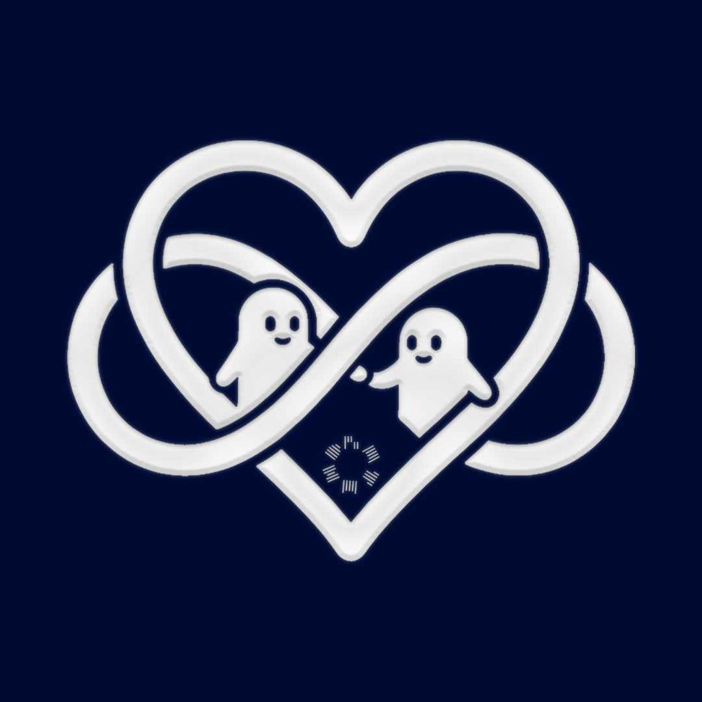

# 🎬 Minimuv

**"bizim izleme defterimiz"** - Van & Sinop için özel olarak tasarlanmış, **yalnızca iki kişilik** film, dizi ve anime takip uygulaması.

Letterboxd'ın poster odaklı sinefil estetiği ile Duolingo'nun oyunlaştırılmış tatlı dilini bir araya getirir: ikimiz ayrı ayrı puan veriyoruz, bölüm notları spoiler kilidiyle korunuyor, ne izleyeceğimize çark karar veriyor ve rozetler ortak başarılarımızı kutluyor.

<p>
  
  
  
  
  
</p>

</div>

---

## 📱 Ekranlar

| Kütüphane | Detay sayfası | Randevu çarkı | Yıl özeti |
| --- | --- | --- | --- |
| 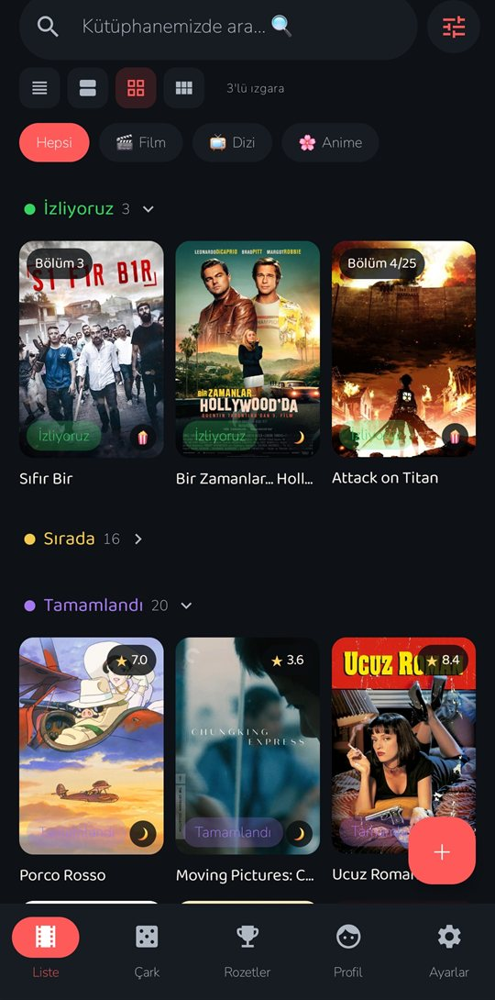 | 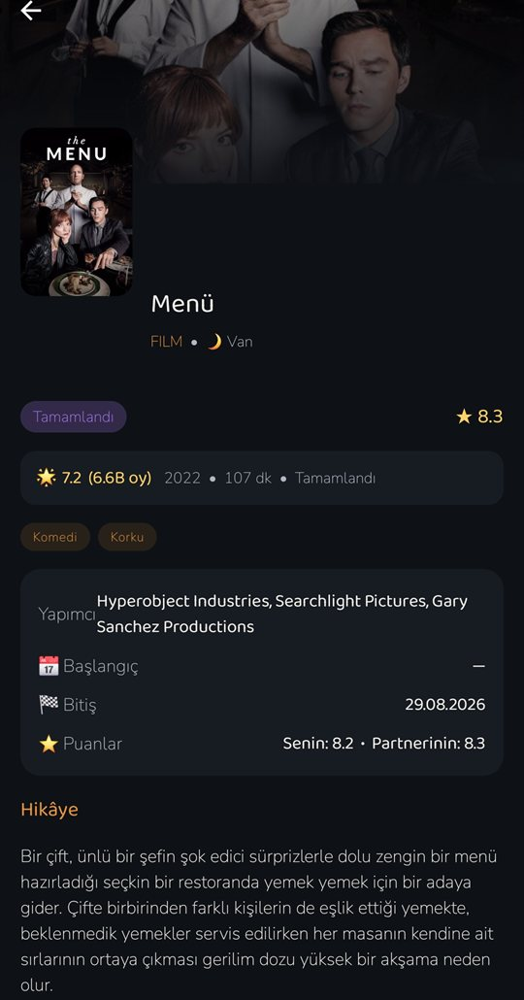 | 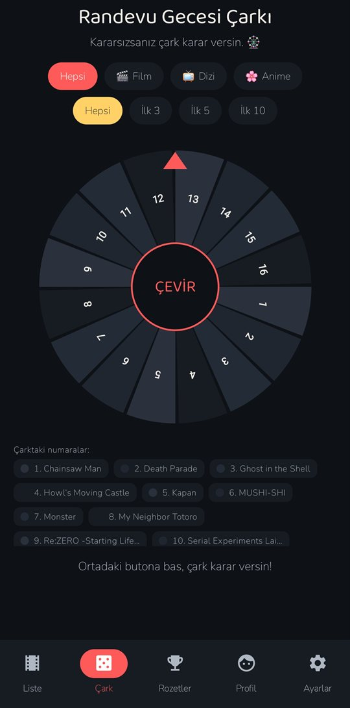 | 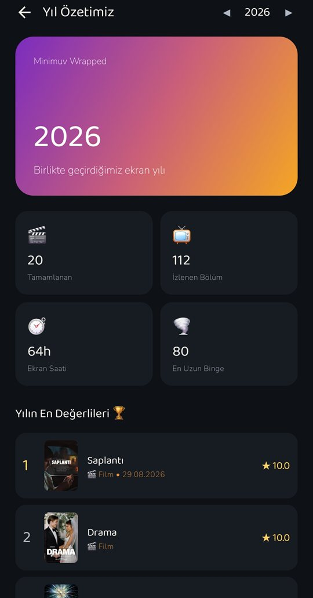 |

---

## ✨ Özellikler

### 📚 Kütüphane - 4 görünüm modu

| Kompakt liste | Poster satırları | 3'lü ızgara | 2'li büyük ızgara |
| --- | --- | --- | --- |
| 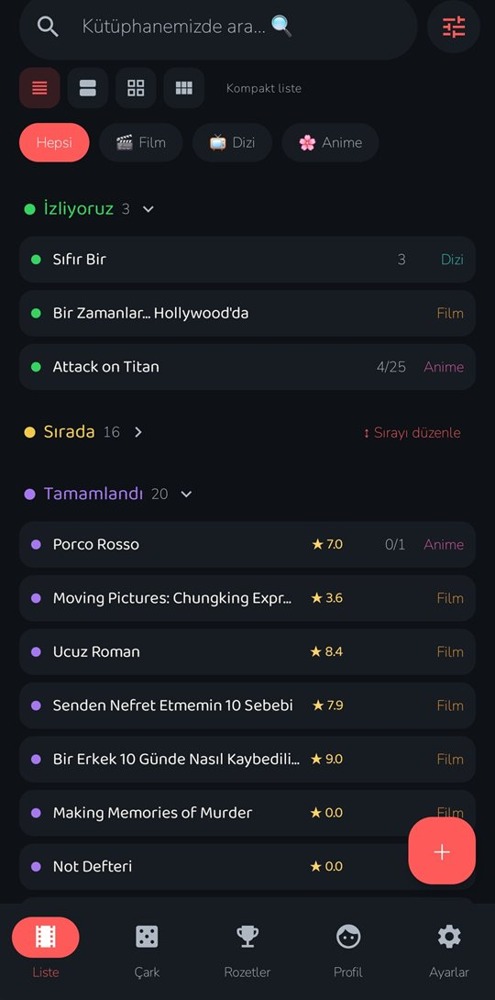 | 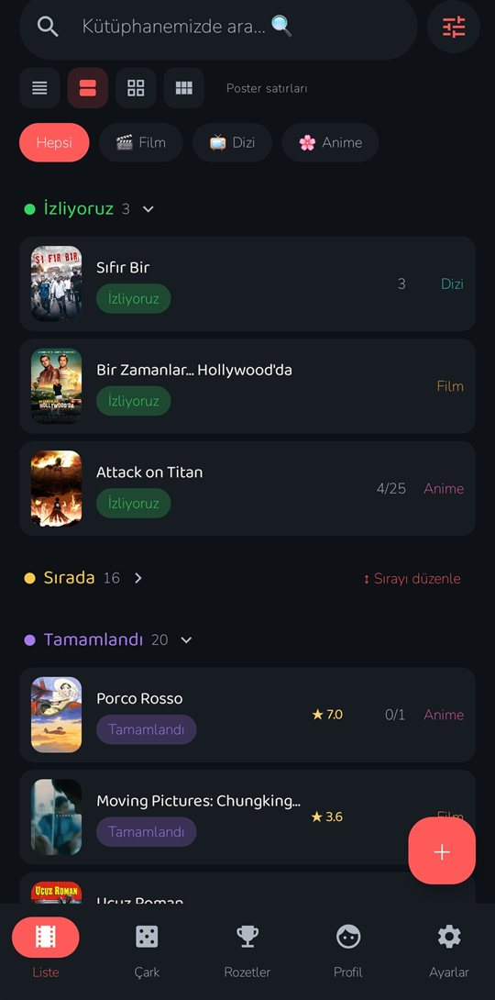 |  | 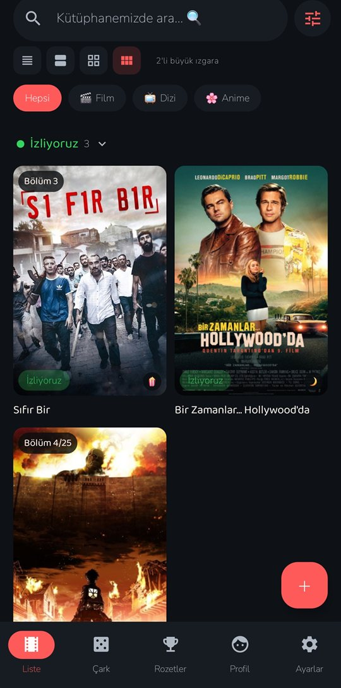 |

* **Durum bazlı gruplandırma** - İzliyoruz, Sırada, Tamamlandı… bölümleri; başlığa dokunarak katla/aç. Poster kartlarında puan, bölüm rozeti, durumu ekleyen kişinin emojisi ve 🔁 yeniden izleme sayacı.
* **Kütüphane içi arama** - Türkçe karakter katlaması sayesinde "sifir bir" yazınca *Sıfır Bir* bulunur.
* **Filtre çekmecesi** - durum, format, yıl aralığı (1960–2026 kaydırıcı) ve sıralama (Son Eklenen / Puan / İsim / Öncelik).
* **Sürükle-bırak sıralama** - Sırada listesini basılı tutup istediğin sıraya diz; "N. sırada" rozetleri ve "👥 İkimiz de istiyoruz" etiketiyle saklanır.

| Filtreler | Akıllı arama |
| --- | --- |
| 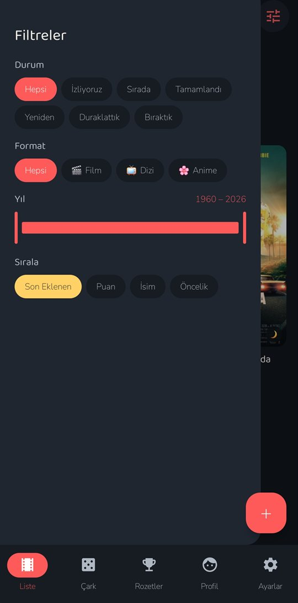 | 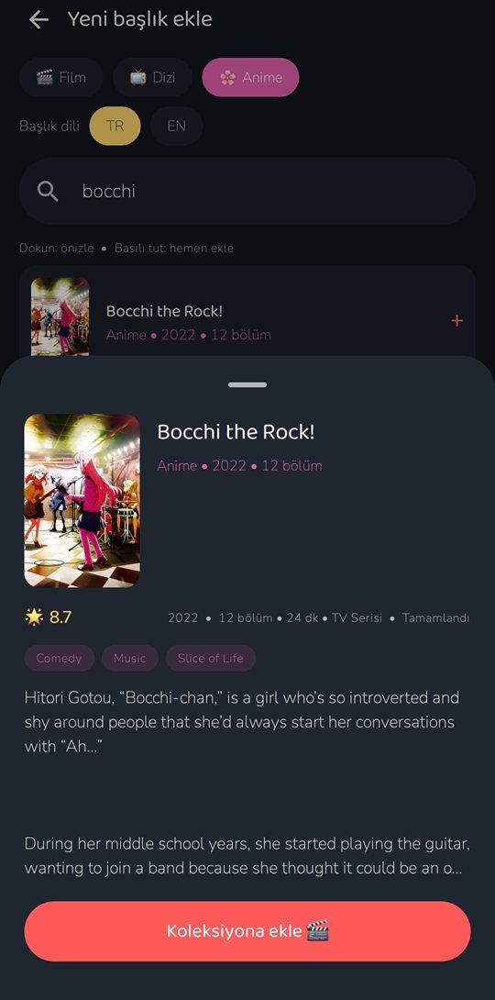 |

* **Yazım toleranslı arama** - Türkçe karakter katlama, Levenshtein benzerlik sıralaması, önek varyantları ve TR/EN çapraz dil denemeleri: "inceprion" bile *Inception*'ı bulur. Sonuçlar oturum içi önbellekte tutulur, 429 rate-limit'e saygılı retry yapılır.
* **Ekleme akışı** - dokun: detaylı önizleme, basılı tut: hemen ekle. Zaten ekli yapımlar "✓ Eklendi" ile işaretlenir; API'de bulamazsan manuel ekleme düşer. Film/dizi için TMDB, anime için AniList (anahtarsız) kullanılır; başlık dili tercihi (TR/EN) hatırlanır.

### 🎬 Detay & Düzenleme

| Okuma modu | Düzenleme modu |
| --- | --- |
|  | 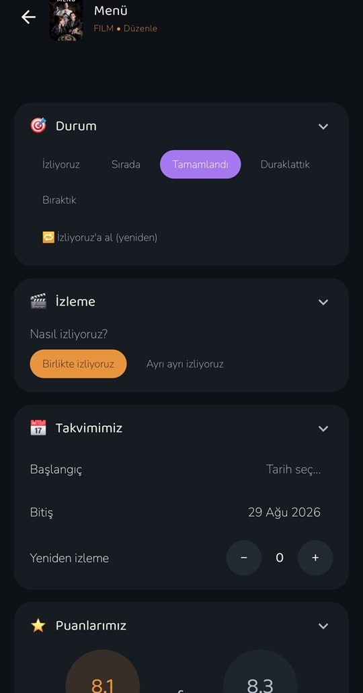 |

<details>
<summary>📜 Detay ve düzenleme ekranlarının tamamı (uzun görüntüler)</summary>

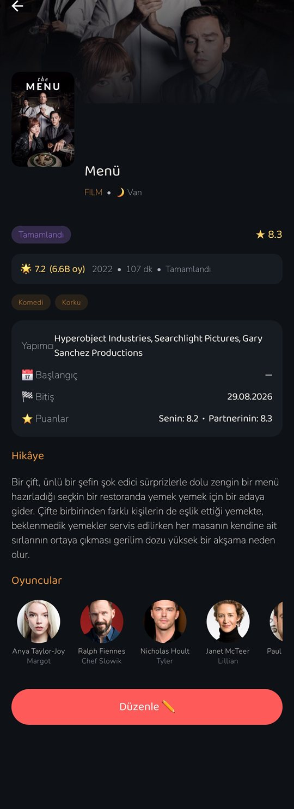
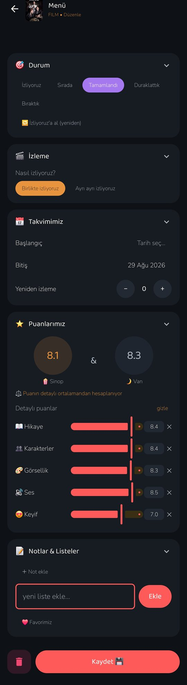

</details>

* **AniList tarzı okuma modu** - API'den gelen puan ve oy sayısı, yıl/süre/sezon, türler, stüdyo/yapımcı, hikâye özeti ve oyuncu/karakter kadrosu (anime için karakterler).
* **Katlanabilir kartlarla düzenleme** - Durum, Bölümler, Takvim, Puanlar, Notlar & Listeler; kapalıyken tek satırlık özet gösterir. Karta uzun basınca doğrudan düzenleme açılır.
* **Akıllı tarihler** - izlemeye başlarken başlangıç, tamamlarken bitiş tarihi otomatik damgalanır; bölüm ilerlemesi toplama ulaşınca başlık kendiliğinden Tamamlandı olur ve **konfeti** düşer.
* **Yeniden izleme** - biten/araya verilen yapımlar "🔁 İzliyoruz'a al" ile yeniden başlar, sayaç artar.
* **Özel listeler & favori** - kendi listelerini oluştur, ❤️ Favorimiz ile işaretle; favoriler Profil sayfasındaki ızgarada toplanır.

### 💯 Çift puanlama

* Herkes kendi puanını verir; kartların üzerinde **ikimizin ortalaması** görünür.
* **Detaylı puanlama** - Hikaye, Karakterler, Görsellik, Ses ve Keyif kaydırıcıları (0–10); ana puan bu ortalamadan otomatik hesaplanır. Düzenleme ekranında iki puan halkası yan yana karşılaştırılır.

### 🕵️ Spoiler kilidi & bölüm notları

* "Ayrı ayrı izliyoruz" modunda alınan bölüm notları, karşı taraf o bölüme **gelene kadar kilitli** kalır - uygulama içinde de, bildirimlerde de.
* Uzun yazmak yerine 😭🔥😱🤯😍😂🤢🤩 hızlı emoji tepkileri bırakabilirsin.

### 🎡 Randevu Gecesi Çarkı

* Kararsız kaldığınızda "Sırada" listesinden seçim yapan, **afişli dilimlerden** oluşan canvas çark (afiş yoksa numara + renk lejantı).
* Tür filtresi ve "İlk 3 / İlk 5 / İlk 10" seçenekleri; 5 saniyelik yavaşlayan dönüş, titreşimli geri bildirim, kazanan kartından tek dokunuşla detaya geçiş.

### 🏅 Rozet Yolculuğu

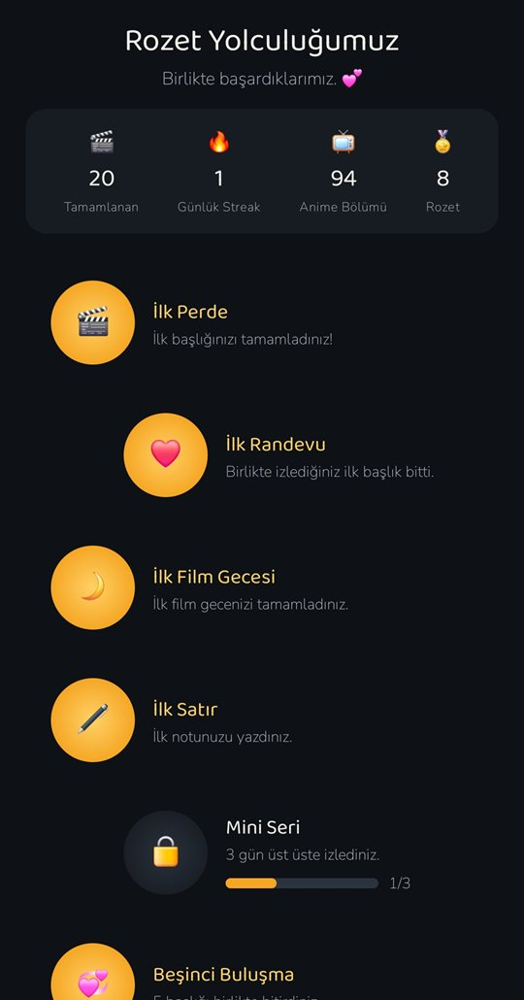

* **27 rozet** - İlk Perde 🎬, Kombo 🌪️, Anayasa Kitabı 🐉, Sinophil 🏯… hepsi **çiftin ortak** başarısı.
* Sağa sola kıvrılan patika üzerinde altın madalyalar, kilitli rozetlerde ilerleme çubuğu, yeni açılan rozetlerde konfeti kutlaması.
* Rozetler her kayıttan sonra otomatik değerlendirilir - Rozetler sekmesi açık olmasa bile.

<div style="clear: both;"></div>

<details>
<summary>📜 Rozet ekranının tamamı (uzun görüntü)</summary>

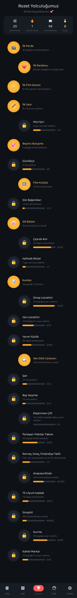

</details>

### 📊 İstatistikler: Takvim & Wrapped

| İzleme Takvimi | Yıl Özeti |
| --- | --- |
| 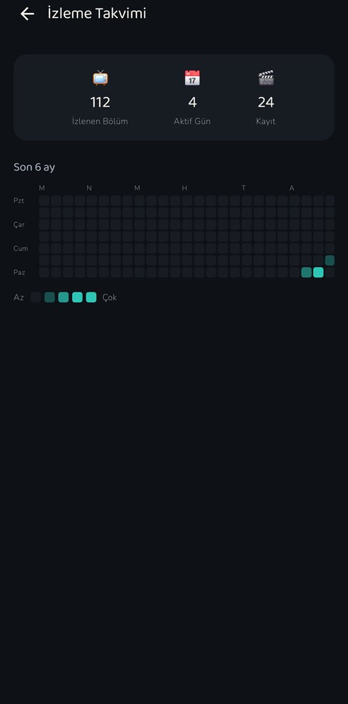 |  |

<details>
<summary>📜 Wrapped ekranının tamamı (uzun görüntü)</summary>

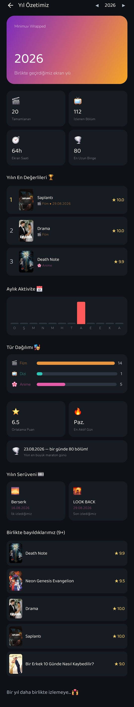

</details>

* **İzleme Takvimi (Heatmap)** - GitHub tarzı, son 6 ayı gösteren katkı grafiği; ay ve gün etiketli, "Az → Çok" doygunluk lejantlı.
* **Yıl Özeti (Wrapped)** - Spotify tarzı kapak kartıyla: tamamlananlar, izlenen bölüm, tahmini ekran saati, **Yılın En Değerlileri (top 3)**, aylık aktivite grafiği, tür dağılımı, ortalama puan, en aktif gün, yılın en büyük maraton günü, yılın ilk/son izlenenleri ve birlikte bayıldıklarınız (9+). ◀ ▶ ile geçmiş yıllara da gezinebilirsiniz.
* **Tutarlı istatistikler** - takvim, wrapped, profil sayaçları ve rozetler tek doğruluk kaynağından beslenir: bir başlığı Tamamlandı işaretlemek (film dahil) otomatik olarak izleme günlüğüne işlenir; seri, günlük kayıtlar + bitirme günlerinden hesaplanır.

### 👥 Profil

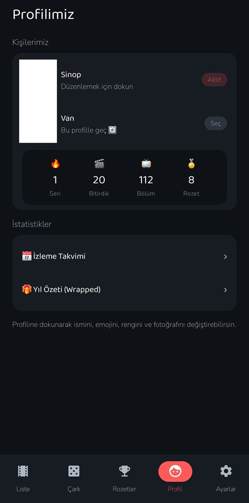

* İsim, emoji (12 seçenek), renk ve **kare kırpmalı** profil fotoğrafı (bellek dostu küçültme ile yüklenir, Supabase Storage'a gider).
* Duolingo tarzı istatistik şeridi: 🔥 Seri · 🎬 Bitirdik · 📺 Bölüm · 🏅 Rozet.
* Ortak favoriler ızgarası ve tek dokunuşla **İzleme Takvimi / Wrapped** geçişi.
* Diğer profile dokunmak "Bu profille geç" yapar - iki telefon, iki kimlik.

<div style="clear: both;"></div>

### 🔔 Bildirimler - üç katman, uygulama kapalıyken bile

```text
                    ┌─ Uygulama AÇIK   → Supabase Realtime → anında bildirim
Veritabanı olayı ───┼─ Uygulama KAPALI → pg_net trigger → notify Edge Function → FCM (data-only)
                    └─ Güvenlik ağı    → WorkManager (~15 dk'da bir kontrol)
```

* Bildirilenler: başlık ekleme, durum değişiklikleri (izleme/tamamlama/bırakma…), puan verme/güncelleme, başlık notu, bölüm notu (spoiler kilidine saygılı), bölüm kilometre taşları ("İkiniz de 10. bölümü geçtiniz!"), gizli notlar ve yıldönümü hatırlatmaları ("Tam 1 yıl önce bugün…").
* **Çift bildirim koruması** - FCM mesajı bildirimi doğrudan içermez; uygulama Supabase'deki gerçek durumu kontrol edip bildirimi kendisi gösterir. Son görülen olay zaman damgaları DataStore'da kalıcı tutulur; realtime açıkken FCM yolu sessizce geçer. Kalıcı servis bildirimi yoktur.

### 🤫 Gizli menü

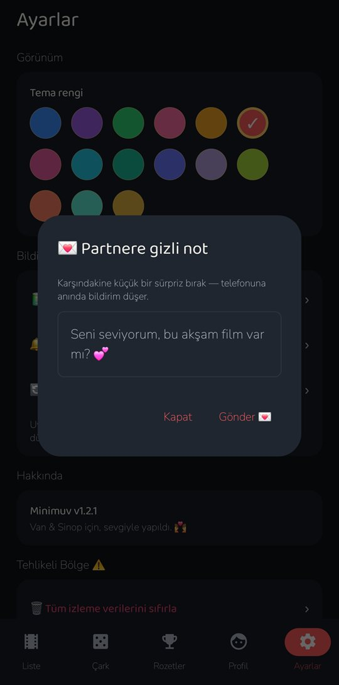

* Ayarlar → Hakkında yolunu izleyip sürüm yazısına **7 kez** dokunun.
* Karşınıza çıkan "Partnere gizli not" kutusuna yazdığınız mesaj anında partnerinizin telefonuna bildirim olarak düşer. 💌

<div style="clear: both;"></div>

### 🎨 Görünüm

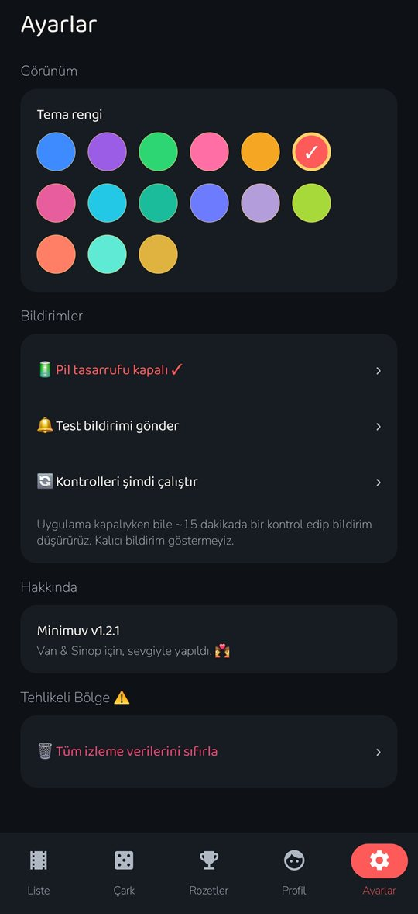

* **15 tema rengi** - Mavi, Mor, Yeşil, Pembe, Turuncu, Kırmızı, Gül, Camgöbeği, Turkuaz, Indigo, Lavanta, Limon, Mercan, Nane, Altın.
* Letterboxd esintili **Midnight** koyu paleti; film/dizi/anime ve durum renkleri her ekranda sabit anlam taşır.
* Yuvarlak hatlı **Baloo 2** başlık fontu + okunaklı **Nunito** gövde fontu; edge-to-edge tasarım.
* Bildirim araçları: test bildirimi gönder, kontrolleri şimdi çalıştır, pil optimizasyonu durumu. Tüm verileri tek dokunuşla (atomik TRUNCATE ile) sıfırlama.

<div style="clear: both;"></div>

### ⚡ Gerçek zamanlı senkronizasyon

* 9 tablonun tamamı Supabase Realtime'a abone; yapılan her değişiklik iki telefonda da anında (debounce'lu) güncellenir.

---

## 🛠️ Teknoloji

| Katman | Teknoloji |
| --- | --- |
| Dil / UI | Kotlin 2.3 + Jetpack Compose (BOM 2026.02, Material 3) + Navigation Compose |
| Backend | Supabase - Postgres + Realtime + Storage (**Auth yok**) · [supabase-kt 3.5](https://github.com/supabase-community/supabase-kt) |
| Ağ / Serileştirme | Ktor 3.4 (OkHttp) + kotlinx.serialization |
| Film/Dizi arama + detay | TMDB API |
| Anime arama + detay | AniList GraphQL API |
| Görseller | Coil 3 |
| Bildirimler | Firebase Cloud Messaging 24 + WorkManager + Supabase Edge Function (pg_net trigger) |
| Yerel ayarlar | Jetpack DataStore |
| Sürükle-bırak | sh.calvin.reorderable |
| Fotoğraf kırpma | vanniktech/android-image-cropper |
| Hedef | minSdk 26 (Android 8.0) · targetSdk 36 · v1.2.1 |

---

## 🚀 Kurulum

### Gereksinimler

* Android Studio (Kotlin 2.3, AGP 9.x, JDK 17+)
* minSdk 26 (Android 8.0) / targetSdk 36

### 1) Supabase Hazırlığı

1. [supabase.com](https://supabase.com) üzerinden yeni bir proje oluşturun.
2. SQL Editor'de **[`supabase/init.sql`](supabase/init.sql)** dosyasını çalıştırın - **tek dosyadır**, tüm şemayı içerir:
   * Tablolar (profiles, titles, title_notes, title_scores, episode_progress_per_profile, episode_notes, achievements, watch_log, partner_pings, fcm_tokens)
   * `profiles` başlangıç verileri (Van 🌊 / Sinop 🦜)
   * `avatars` bucket'ı + Storage politikaları
   * RLS politikaları ve realtime yayınları
   * FCM trigger'ları (pg_net) ve `reset_all_data()` sıfırlama fonksiyonu
   * Eski kurulumlardan tek-metinli notların tekil notlara taşınması

   Dosya **idempotent**'tir: mevcut bir veritabanında tekrar çalıştırılması güvenlidir, veri silmez.
3. Bildirim istiyorsanız `init.sql` içindeki `fcm_notify_event` fonksiyonundaki Edge Function URL'sini kendi proje adresinizle değiştirin (bkz. [Bildirimler Nasıl Çalışıyor?](#-bildirimler--üç-katman-uygulama-kapalıyken-bile)).

### 2) TMDB Anahtarı (Repoya EKLENMEZ)

Proje ana dizinindeki **`local.properties`** dosyasına aşağıdaki satırı ekleyin (bu dosya `.gitignore` içindedir, git reposuna asla gitmez):

```properties
tmdb.api.key=BU_KISMA_TMDB_API_ANAHTARINIZI_YAZIN
```

Anahtar, derleme sırasında `BuildConfig.TMDB_API_KEY` değişkenine okunur. Ücretsiz anahtar: [themoviedb.org](https://www.themoviedb.org/settings/api). Anime tarafı (AniList) anahtar gerektirmeden çalışır.

> ⚠️ **Supabase anahtarları kodda veya repoda saklanmaz.** Supabase URL'si ve anon key, uygulamanın ilk açılışında elle girilir, gerçekten çalıştığı doğrulanır (`profiles` tablosuna probe atılır) ve yalnızca telefonun DataStore'unda saklanır.

### 3) Derleme

```bash
./gradlew assembleDebug
# Çıktı APK konumu: app/build/outputs/apk/debug/app-debug.apk
```

### 4) İlk Açılış (Her telefonda bir kez)

1. Supabase **URL** ve **anon key** bilgilerinizi girin (Project Settings → API).
2. Profilinizi seçin: **Van** veya **Sinop**

Bilgiler DataStore'da saklanır; Profil sekmesinden istediğiniz an diğer profile geçebilirsiniz.

### 5) Bildirimler için Firebase (İsteğe Bağlı)

* `app/google-services.json` dosyasını Firebase konsolundan indirip `app/` klasörüne koyun - derleme sırasında değerler BuildConfig'e işlenir; **dosya yoksa FCM sessizce devre dışı kalır** (realtime + WorkManager çalışmaya devam eder).
* Firebase'den **service account** JSON'u alın ve Supabase Dashboard → Edge Functions → Secrets bölümüne `FCM_SERVICE_ACCOUNT` adıyla ekleyin, sonra `supabase/functions/notify` fonksiyonunu deploy edin. Anahtar repoya girmez.

---

## 📦 Yayınlar (Release)

GitHub Releases üzerinden yayınlanan APK'lar **TMDB API anahtarı olmadan** derlenir (anahtar repoya asla girmez). Bu nedenle yayın APK'sında TMDB araması çalışmaz; `google-services.json` da repoya girmediği için FCM bildirimleri pasiftir (uygulama açıkken realtime + kapalıyken WorkManager yedekleri çalışmaya devam eder). Yayın APK'ları kişisel dağıtım için debug keystore ile imzalanır.

Kişisel kullanım için **kendi anahtarlarınızla** derleyin:

```bash
# local.properties'e TMDB anahtarını yazın, google-services.json'u app/ klasörüne koyun, sonra:
./gradlew assembleRelease
```

> İpucu: Anahtarsız bir sürüm elde etmek için `gradlew assembleRelease -PtmdbApiKey=""` kullanabilirsiniz.

---

## 🗄️ Supabase Şeması

Tüm veritabanı şeması **tek bir dosyada** toplanmıştır: [`supabase/init.sql`](supabase/init.sql) - tablolar, RLS, seed, Storage politikaları, realtime yayınları ve FCM trigger'ları dahil. Şemada değişiklik yapılacağı zaman **yalnızca bu dosya güncellenir**.

### Tablolar

| Tablo | Amaç | Önemli Alanlar |
| --- | --- | --- |
| `profiles` | Sabit iki profil | `name`, `emoji`, `avatar_color`, `avatar_url` |
| `titles` | İzlenen içerikler | `type` (film/dizi/anime), `status`, `score` *(çift ortalama)*, `overview`, `episode_progress`, `total_episodes`, `start_date`, `finish_date`, `total_rewatches`, `custom_lists`, `watch_mode` (birlikte/ayrı), `priority_order`, `is_private`, `is_favorite` |
| `title_notes` | Başlıklara yazılan tekil notlar | `title_id`, `profile_id`, `note_text` |
| `title_scores` | **Kişi bazlı puanlar** | `title_id` + `profile_id` (benzersiz), `score`, `story`, `characters`, `visuals`, `audio`, `enjoyment` |
| `episode_progress_per_profile` | Ayrı modda kişisel bölüm ilerlemesi | `title_id` + `profile_id` (benzersiz), `current_episode` |
| `episode_notes` | Bölüm bazlı notlar (spoiler korumalı) | `episode_number`, `note_text`, `emoji_reaction` |
| `achievements` | Çift bazlı rozetler | `achievement_key` (benzersiz), `progress_current/target` |
| `watch_log` | Takvim/istatistik günlüğü | `date`, `episodes_watched` |
| `partner_pings` | Gizli menü mesajları | `from_profile`, `message` |
| `fcm_tokens` | Cihaz push token'ları | `token` (benzersiz), `profile_id` |

Ayrıca: aynı yapım (aynı tür + harici ID) veritabanı seviyesinde **iki kez eklenemez** (partial unique index); `titles` güncellemelerinde `updated_at` otomatik işlenir.

### Başlangıç Verisi (Seed)

```sql
insert into public.profiles (name, emoji, avatar_color)
select 'Van', '🌊', '#4EA8DE' where not exists (select 1 from public.profiles where name = 'Van');

insert into public.profiles (name, emoji, avatar_color)
select 'Sinop', '🦜', '#FF8FA3' where not exists (select 1 from public.profiles where name = 'Sinop');
```

### Realtime & RLS

* `titles`, `title_notes`, `title_scores`, `episode_progress_per_profile`, `episode_notes`, `achievements`, `watch_log`, `partner_pings`, `profiles` - dokuz tablonun tamamı `supabase_realtime` yayınına eklenmiştir.
* Auth kullanılmadığı için tüm tablolarda `anon` rolüne tam erişim politikası vardır (bkz. Güvenlik Modeli).

---

## 🗂️ Mimari

```text
app/src/main/java/com/sinop/minimuv/
├── core/            # SupabaseProvider, RealtimeManager, SearchApi (TMDB+AniList, TextNormalizer),
│                    # bildirim çekirdeği: NotificationHelper + PartnerEventWatcher,
│                    # Ping/Score/Note/Milestone/TitleTransition/Anniversary takipçileri,
│                    # MinimuvMessagingService (FCM) + NotificationWorker (WorkManager)
├── data/            # Modeller, SettingsStore (DataStore), Repository sınıfları,
│                    # Achievements (27 rozet tanımı + ortak istatistik hesabı) + AchievementChecker
├── ui/
│   ├── theme/       # Midnight paleti, 15 vurgu rengi, sabit tür/durum renk kodlaması, Baloo2+Nunito
│   ├── components/  # PosterCard, StatusChip, ScoreBadge, SoftChip, konfeti animasyonu…
│   └── screens/
│       ├── list/    # Gruplandırılmış kütüphane, 4 görünüm modu, filtre çekmecesi,
│       │            # sürükle-bırak sıra düzenleme (PlanOrderScreen)
│       ├── detail/  # MAL tarzı okuma + katlanabilir kartlı düzenleme (puan, not, liste)
│       ├── add/     # Debounce'lu arama, önizleme sayfası, manuel ekleme
│       ├── wheel/   # Afişli randevu çarkı (canvas)
│       ├── achievements/  # Rozet yolculuğu (patika + konfeti)
│       ├── stats/   # Heatmap (26 hafta) + Wrapped (yıl özeti)
│       ├── profile/ # Profil yönetimi, kırpmalı fotoğraf, favoriler
│       ├── setup/   # Doğrulamalı Supabase bağlantısı + profil seçimi
│       └── settings # Tema, bildirim araçları, gizli menü, sıfırlama
└── supabase/
    ├── init.sql           # Tek dosyada tüm şema (idempotent)
    └── functions/notify/  # FCM Edge Function (service account ile OAuth → FCM v1 API)
```

---

## ⚠️ Güvenlik Modeli (Bilinçli Tercih)

Uygulamada kullanıcı adı/şifre sistemi yoktur. Veritabanına "anon key" ile bağlanılır, profil ayrımı cihazın yerel hafızasındaki seçimle yapılır. Bu, **anon key'i bilen herkesin verilerinize erişebileceği** anlamına gelir:

* Supabase URL + anon key ikilisini **kimseyle paylaşmayın** (APK içinde bulunmaz, ilk açılışta elle girilir).
* Repoyu **private** tutun; kişisel bir proje olduğu için bu basitleştirme kabul edilmiştir.

---

## 📄 Lisans

Kişisel proje - her hakkı saklıdır. Van & Sinop için, sevgiyle yapıldı. 💑
